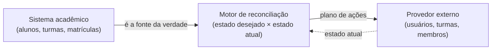
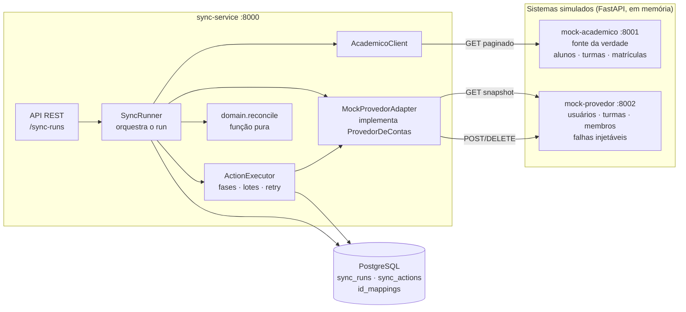

# edu-sync — sincronizador entre sistema acadêmico e provedor de contas

Serviço em Python que mantém um **provedor externo de contas e turmas** (algo como Google
Workspace/Classroom) sincronizado com um **sistema acadêmico**, comparando os dois estados e
aplicando só a diferença. É idempotente, tolera falhas parciais, repete o que vale repetir e
registra tudo no PostgreSQL.

**Stack:** Python 3.12 · FastAPI · httpx · SQLAlchemy 2 (async) · Alembic · PostgreSQL 16 ·
Docker Compose · pytest · respx · Ruff · GitHub Actions.

- [Problema](#1-o-problema) · [Por que existe](#2-por-que-este-projeto-existe) ·
  [Arquitetura](#3-arquitetura) · [Fluxo](#4-fluxo-read--compare--plan--execute--audit)
- [Idempotência](#5-idempotência) · [Dry-run](#6-dry-run) · [Retry](#7-retry) ·
  [Falha parcial](#8-falha-parcial) · [Reprocessamento](#9-reprocessamento-retry-failed)
- [Banco](#10-banco-de-dados) · [Performance](#11-performance-números-medidos) ·
  [Decisões](#12-decisões-arquiteturais) · [Limitações](#13-limitações) ·
  [Próximos passos](#14-próximos-passos)
- [Como executar](#15-como-executar) · [Testes](#16-testes) · [CI](#17-ci)

---

## 1. O problema

Uma escola mantém alunos, turmas e matrículas no sistema acadêmico, mas as contas de e-mail e as
salas virtuais vivem em outro sistema. Alguém precisa garantir que os dois estejam de acordo:
aluno novo ganha conta, quem trocou de turma sai de uma sala e entra em outra, quem saiu perde o
acesso.



Fazer isso "na mão" ou por scripts ad hoc costuma falhar nos casos que importam: o script roda
duas vezes e duplica contas, o provedor devolve 429 no meio e metade dos alunos fica sem
acesso, ninguém sabe o que foi aplicado e o que não foi.

## 2. Por que este projeto existe

Ele recria, de forma didática, um problema real de **integração entre sistemas**: reconciliar
duas fontes de dados que divergem, de forma segura de repetir e auditável. É um projeto de
portfólio, e por isso:

- **todo o código é original**, escrito do zero para este repositório;
- **todos os dados são fictícios** (gerados com Faker, nomes sintéticos, domínio `example.edu`);
- **nenhum sistema, escola, empresa ou credencial real** é usado. O "provedor" e o "acadêmico"
  são serviços simulados (`mock-provedor`, `mock-academico`), e não há integração com Google.

## 3. Arquitetura



| Componente | Papel |
|---|---|
| `mock-academico` | Fonte da verdade fictícia. Alunos, turmas e matrículas paginados; gera o dataset com Faker; admin para simular alterações. |
| `mock-provedor` | Provedor externo fictício. Usuários, turmas e membros, com 409/404/422, 429, 5xx, latência e "operação aplicada mas a resposta se perdeu". |
| `sync-service` | O produto. Lê os dois lados, reconcilia, executa com retry e audita. |
| PostgreSQL | Histórico de execuções, ações (com tentativas e erros) e o índice de ids. |

O motor só conhece a interface `ProvedorDeContas` (`providers/base.py`). Os detalhes HTTP do
mock ficam no `MockProvedorAdapter`. Trocar de provedor é escrever outro adapter, sem tocar no
algoritmo de reconciliação.

```text
services/
├── mock-academico/   src/mock_academico   (dataset Faker, paginação, /_admin)
├── mock-provedor/    src/mock_provedor    (API do provedor, falhas injetáveis, /_admin)
└── sync-service/
    ├── alembic/                            (migrations)
    ├── src/sync_service/
    │   ├── domain/        modelos, geração de e-mail e reconcile()   <- puro, sem I/O
    │   ├── resilience/    retry, classificação de erros, limite de taxa
    │   ├── clients/       leitura do acadêmico, paginação
    │   ├── providers/     interface ProvedorDeContas + adapter do mock
    │   ├── sync/          runner, executor, snapshot, store (SQL)
    │   ├── db/            modelos SQLAlchemy
    │   └── api/           rotas FastAPI
    └── tests/             unit/ · integration/ · sync_testkit/
scripts/                   benchmark.py · http_client_probe.py
docs/                      ESPECIFICACAO.md · benchmark.md
INTERVIEW.md               perguntas e respostas técnicas sobre a implementação
```

## 4. Fluxo: read → compare → plan → execute → audit

Uma sincronização (`SyncRunner.execute_run`) faz, nesta ordem:

1. **Read.** Busca em paralelo o estado desejado (acadêmico) e o estado atual (snapshot do
   provedor), com paginação e concorrência limitada.
2. **Compare.** `reconcile(desired, current)` compara os dois. É uma função pura: sem HTTP, sem
   banco, sem relógio. Só entidades que o sync "possui" (com `external_id`) entram na conta.
3. **Plan.** O resultado é uma lista ordenada de ações (`CREATE_CLASS`, `CREATE_USER`,
   `REACTIVATE_USER`, `REMOVE_FROM_CLASS`, `ADD_TO_CLASS`, `SUSPEND_USER`) com dependências.
   O plano é gravado em `sync_actions`.
4. **Execute.** As ações rodam por fases (barreira entre elas), em lotes, com concorrência
   limitada. Cada ação tem retry próprio. Uma que falha não derruba as outras.
5. **Audit.** Cada resultado (status, tentativas, último erro, horário) é gravado em lote. Ao
   fim, o run recebe os contadores (por agregação no banco) e métricas (tempos, requests, retries).

Ordem das fases: criar turmas → criar/reativar usuários → remover de turmas → adicionar a
turmas → suspender. Isso garante que numa troca de turma o aluno nunca fica nas duas, e que um
usuário suspenso nunca é matriculado.

Decisões de negócio do `reconcile`:

| Situação | Ações geradas |
|---|---|
| Aluno novo | `CREATE_USER` (+ `ADD_TO_CLASS`) |
| Trocou de turma A → B | `REMOVE_FROM_CLASS A`, `ADD_TO_CLASS B` |
| Saiu do acadêmico | `REMOVE_FROM_CLASS` (por turma) + `SUSPEND_USER`. **Nunca** `DELETE`. |
| Voltou | `REACTIVATE_USER` + `ADD_TO_CLASS` |
| Turma nova | `CREATE_CLASS` |
| Nada mudou | nenhuma ação |
| Colisão de e-mail | `joao.silva`, `joao.silva2`, `joao.silva3`... (determinístico) |

## 5. Idempotência

Rodar a sincronização duas vezes sobre o mesmo estado: a primeira faz o trabalho, a segunda não
faz nada. Saída real, com o dataset padrão (20 alunos, 3 turmas):

```text
POST /sync-runs  (1ª vez)  -> 43 ações   {"CREATE_USER": 20, "ADD_TO_CLASS": 20, "CREATE_CLASS": 3}
POST /sync-runs  (2ª vez)  ->  0 ações   (só 5 leituras no provedor, nenhuma escrita)
```

A idempotência vem de quatro camadas:

- **Algoritmo:** compara estados, não replica comandos. Se o atual já é o desejado, devolve `[]`.
- **Serviço:** o plano é sempre recalculado do estado observado; só um run real por vez
  (índice único parcial no PostgreSQL).
- **Chamadas ao provedor:** são seguras de repetir. `409` por `external_id` vira "já existe,
  adote o id" (`already_applied`); `404` ao remover membro inexistente também.
- **Persistência:** `UNIQUE (run_id, action_key)`, upsert de mapeamentos.

O caso difícil: **a ação é aplicada, mas a resposta se perde**. O cliente acha que falhou e
repete. Como o `POST /users` repetido recebe `409` com o `external_id`, a ação conclui como
`already_applied` e adota o usuário que já existe, sem duplicar. Do teste automatizado:

```text
POST /users  -> aplicado no provedor, resposta perdida (timeout no cliente)
POST /users  -> 409 USER_ALREADY_EXISTS (conflict_field=external_id)
resultado:    1 usuário no provedor · ação CREATE_USER:S1 com attempts=2, outcome=already_applied
```

## 6. Dry-run

Calcula e devolve o plano **sem executar nada no provedor** (como um `terraform plan`). O run e
as ações ficam registrados com status `planned`.

```bash
curl -s -X POST "http://localhost:8000/sync-runs?dry_run=true"
```

Resposta real (resumida):

```json
{
  "status": "planned", "dry_run": true, "total_actions": 43,
  "counters": {"CREATE_USER": 20, "ADD_TO_CLASS": 20, "CREATE_CLASS": 3},
  "actions": [
    {"seq": 0, "action_key": "CREATE_CLASS:CLS-001", "status": "planned"},
    {"seq": 1, "action_key": "CREATE_CLASS:CLS-002", "status": "planned"}
  ]
}
```

Na escala de 4.000 alunos o plano (8.090 ações) é devolvido inteiro numa resposta (1,4 a 1,6 s).

## 7. Retry

Retry é feito **em volta de cada ação** (e de cada página lida), com backoff exponencial e jitter.
Só erros que podem passar sozinhos são repetidos:

| Resposta / falha | Decisão | Por quê |
|---|---|---|
| `429` | **retry** | Limite de taxa. Respeita o `Retry-After` do servidor. |
| `408`, `500`, `502`, `503`, `504` | **retry** | Falha temporária do servidor. |
| Timeout, conexão recusada, erro de protocolo | **retry** | Falha de rede. |
| `400`, `401`, `403`, `422`, `404` inesperado | **sem retry** | Repetir não muda a resposta; só gasta cota e esconde um bug. |
| `409` por `external_id`, `404 MEMBERSHIP_NOT_FOUND` | **sucesso** (`already_applied`) | O estado desejado já valia. |
| `409` por e-mail de outra pessoa | **sem retry** (`EMAIL_CONFLICT`) | O e-mail alocado ficou obsoleto. |

Política padrão (todas configuráveis por variável de ambiente, veja `.env.example`):

```text
máx. 5 tentativas · atraso base 0,5 s · fator 2 · teto 30 s · jitter total
tetos de atraso por retry:  0,5 s → 1 s → 2 s → 4 s   (o atraso real sorteia entre 0 e o teto)
Retry-After do servidor vira piso do atraso (limitado a 60 s) · orçamento de 120 s por operação
```

Se as tentativas esgotam, a ação vira `failed` com `RETRIES_EXHAUSTED`, o run **continua**, e
o `retry-failed` pode retomá-la depois. Se muitas ações seguidas esgotam (25 por padrão), o run
é abortado (`aborted`): é sinal de que o provedor está fora do ar.

Para não depender do `429` para descobrir o limite, o cliente pode se limitar sozinho
(`PROVIDER_MAX_RPS`, desligado por padrão): ele espaça as requisições, retries inclusive.

## 8. Falha parcial

Se a ação 3 de 4 falha, as outras continuam, e a falha fica registrada. Saída real de um run em
que o provedor recusa (`400`) a criação de um aluno:

```text
GET /sync-runs/{id}  ->  status: partial · 8 ações · 6 ok · 1 falha · 1 pulada

CREATE_USER:S2     failed    attempts=1  error_code=VALIDATION_ERROR
                             last_error="POST /users -> 400 VALIDATION_ERROR: validation_error"
                             last_attempt_at=2026-10-02T17:42:36Z
ADD_TO_CLASS:S2|A  skipped   attempts=0  error_code=DEPENDENCY_FAILED
```

- O `400` é permanente: falhou na **1ª tentativa**, sem retry.
- A matrícula do aluno que não foi criado é **pulada** (`skipped`), sem chamar o provedor e sem
  gerar um erro em cascata difícil de interpretar.
- Os outros 6 alunos e turmas foram aplicados normalmente.

## 9. Reprocessamento: `retry-failed`

```bash
curl -s -X POST "http://localhost:8000/sync-runs/<id>/retry-failed"
```

Reprocessa **só** as ações elegíveis daquele run: `failed`, `pending` (de um run interrompido) e
`skipped` por `DEPENDENCY_FAILED`/`RUN_ABORTED`. As que deram certo não são tocadas, e o plano
**não é recalculado** (os ids do provedor vêm de `id_mappings`, sem buscar o estado de novo).
Saída real, depois de corrigir o problema:

```text
POST retry-failed        -> 202  {status: running, retry_count: 1}
depois do retry          -> status: succeeded · 8 ok · 0 falhas · 0 puladas
escritas no provedor     -> 2   (só CREATE_USER:S2 e ADD_TO_CLASS:S2|A)
CREATE_USER:S2           -> succeeded, attempts=2   (1 da execução original + 1 do retry)
CREATE_USER:S1           -> succeeded, attempts=1   (não foi tocada)
POST retry-failed (novo) -> 200  (nada a reprocessar)
```

Como cada operação é idempotente, repetir um plano antigo é seguro; ainda assim, depois de um
retry vale rodar uma sincronização nova para pegar o que mudou no meio tempo.

## 10. Banco de dados

PostgreSQL, SQLAlchemy 2 (async) e Alembic (migration `0001_initial`).

| Tabela | Guarda | Restrições principais |
|---|---|---|
| `sync_runs` | Uma linha por execução: `status` (`running`, `succeeded`, `partial`, `aborted`, `failed`, `interrupted`, `planned`), `dry_run`, `trigger`, `started_at`/`finished_at`, contadores, `counters` e `metrics` (JSONB), `retry_count`, `error` | `CHECK` nos status; **índice único parcial**: no máximo um run real em `running` |
| `sync_actions` | Uma linha por ação: `action_key`, `action_type`, `entity_type/id`, `payload` e `depends_on` (JSONB), `status`, `outcome`, `attempts`, `error_code`, `last_error`, `last_attempt_at` | `FK` para o run (cascata), `UNIQUE (run_id, action_key)` e `(run_id, seq)`, `CHECK` nos tipos (não existe `DELETE_USER`); índices `(run_id, status)` e `(entity_type, entity_id)` |
| `id_mappings` | Índice `id de origem ↔ id do provedor` (usuários e turmas) | `UNIQUE (entity_type, source_id)` e `UNIQUE (entity_type, provider_id)`: não há mapeamento duplicado |

Detalhes que importam:

- Status são `VARCHAR` com `CHECK` (e não enum nativo), que é mais fácil de evoluir com migrations.
- Os contadores do run são calculados por **agregação** (`GROUP BY status`), nunca contados em memória.
- Sem N+1: inserção do plano em blocos, **um** `UPDATE ... FROM unnest(...)` por lote de
  resultados, mapeamentos lidos em uma consulta. Um teste conta os comandos SQL e confirma que
  não crescem com o número de alunos.
- `id_mappings` espelha o que o provedor realmente tem a cada run real (o provedor pode
  reaproveitar ids).

## 11. Performance (números medidos)

Escala de demonstração, gerada com Faker (`seed=42`), tudo em Docker na mesma máquina
(Windows 11, Docker Desktop, 12 CPUs), provedor = mock em memória. Detalhes, método, variações e
limitações em [docs/benchmark.md](docs/benchmark.md).

```text
Dataset:
4.000 alunos
90 turmas
4.000 matrículas (ativas, uma por aluno)

Abertura (8.090 ações):            20,6 a 22,3 s   (3 execuções)
Sem alterações (0 ações):          0,44 a 0,53 s   (3 execuções)
Alterações (805 ações):            2,30 a 2,43 s   (3 execuções)
```

O cenário "alterações" tem 100 alunos novos, 100 que saíram, 200 que trocaram de turma e 5 turmas
novas. Nos três o provedor terminou idêntico ao acadêmico.

| Variação (cenário de abertura) | Resultado |
|---|---|
| Provedor com 20 ms de latência, 10 simultâneas | 24,2 s (com 3 simultâneas: 70 s; com 25: 32 s) |
| Provedor limitado a 300 req/s, cliente **sem** limitador | 46,0 s, 260 respostas `429` respeitadas |
| Mesmo provedor, cliente com limitador de 250 req/s | 34,8 s, **0** respostas `429` |
| 5% de erros 5xx + 2% de respostas perdidas | 43,1 s, 571 retries, **0 falhas**, sync seguinte com 0 ações |

**Não é perfeito, e o motivo está medido:** a abertura é limitada pela biblioteca HTTP do cliente
(`httpx` chega a ~930 req/s e piora com muita simultaneidade; o `aiohttp`, na mesma sonda, fez
~2.600 a 2.900 req/s), e não pelo banco nem pelo algoritmo. Contra o mock local, 3 a 5
simultâneas levam 35-37% menos tempo que o padrão (10); com um provedor mais lento o padrão é o
melhor. Não troquei de biblioteca porque `httpx` + `respx` fazem parte da stack do projeto.
Reproduza com `python scripts/benchmark.py` (stack no ar).

## 12. Decisões arquiteturais

**Por que PostgreSQL?** O projeto depende de garantias que um banco relacional dá de graça:
restrições `UNIQUE`/`CHECK`/`FK`, transações, upsert (`ON CONFLICT`) e um **índice único parcial**
que serve de trava para "um run real por vez". JSONB guarda o payload das ações. Os testes de
integração rodam contra PostgreSQL de verdade (e não SQLite) porque essas garantias se comportam
diferente.

**Por que reconciliação periódica?** Comparar estados converge sempre, mesmo que algo tenha sido
perdido, duplicado, chegado fora de ordem ou alterado à mão no provedor. Eventos são mais
baratos, mas exigem entrega confiável e ordenação, e um evento perdido deixa os sistemas
divergentes até alguém notar. O custo da reconciliação é ler tudo a cada execução: medi 0,5 s
para 4.000 alunos quando nada mudou.

**Por que suspender em vez de excluir?** Excluir é irreversível. Um erro na origem (aluno
inativado por engano) viraria perda de dados, e se perderia o histórico e a auditoria. Suspender
preserva tudo, é reversível (`REACTIVATE_USER`) e a escola decide quando excluir. Não existe nem
um tipo de ação de exclusão, e o banco recusa um (`CHECK`).

**Por que retry apenas em erros transitórios?** `429` e `5xx` costumam passar sozinhos.
Repetir um `400`/`422` nunca passa: gasta cota, atrasa o run e esconde o bug. A lista de
erros retentáveis é uma única função testada em tabela.

**Por que não Redis?** Não há nada para ele fazer aqui. O lock de execução é um índice único
no PostgreSQL (visível como dado, sobrevive a restart), o estado já está no banco e a
concorrência é de I/O dentro de um processo (`asyncio`).

**Por que não RabbitMQ?** Uma fila resolve desacoplamento e entrega a múltiplos consumidores. Aqui
há um produtor e um consumidor, uma execução por dia e ações que já são idempotentes. Adicionaria
infraestrutura para operar sem um benefício que eu consiga demonstrar.

**Por que não Celery?** Pelos mesmos motivos, mais um: o run é uma única unidade de trabalho
longa e sequencial por fases, não um conjunto de tarefas independentes. Se um dia houver vários
tenants ou execução distribuída, filas e workers entram (veja [próximos passos](#14-próximos-passos)).

**Por que não integrar diretamente com Google?** Exigiria credenciais e dados reais, e os testes
e o benchmark deixariam de ser reproduzíveis por qualquer pessoa. O contrato `ProvedorDeContas`
isola o provedor: um `GoogleWorkspaceAdapter` seria uma implementação nova da mesma interface.

**Por que o algoritmo de diff é uma função pura?** `reconcile(desired, current)` não faz I/O,
não lê o relógio nem sorteia nada. Por isso testa em milissegundos, sem mocks; é determinístico
(mesma entrada, mesma lista, na mesma ordem); e vale para qualquer provedor. A suíte verifica
invariantes em 300 cenários aleatórios reproduzíveis (por exemplo: aplicar o plano e reconciliar
de novo devolve zero ações).

## 13. Limitações

Limitações reais, de quem escreveu o código:

- **Não implementado (previsto no escopo inicial):** logs estruturados em JSON (hoje usa o
  `logging` padrão) e a execução diária automática (agendador). Por enquanto a sincronização
  é disparada pela API (um `cron` chamando `POST /sync-runs` resolve).
- **Uma instância.** O run roda em uma tarefa `asyncio` do próprio processo, e no startup todo
  run `running` é marcado como `interrupted`. Com várias réplicas, uma marcaria o run da outra.
- **Run preso se o banco cair na hora de fechá-lo:** ele fica `running` até um restart do
  serviço (que o marca `interrupted`) e, enquanto isso, bloqueia novos runs reais. Não há
  detecção por heartbeat.
- **Sem autenticação.** As APIs (inclusive os endpoints `/_admin` dos mocks) são abertas. O
  compose publica as portas só em `127.0.0.1`, mas isso não é segurança de produção.
- **Provedor real não existe.** Só o mock. O snapshot atual depende de o provedor guardar o
  `external_id` dos recursos; um provedor sem isso exigiria que o adapter usasse `id_mappings`
  (não implementado).
- **Escopo funcional enxuto:** uma matrícula ativa por aluno; sem atualização de nome/e-mail
  (o e-mail é definido na criação e nunca recalculado); sem arquivar/renomear turmas; o
  e-mail usa o último sobrenome e remove acentos por decomposição Unicode (letras como `ß` ou
  `ø` caem no e-mail genérico `aluno...`).
- **`retry-failed` executa o plano antigo.** Se o id de um recurso sumir do provedor nesse
  meio tempo, a ação falha com erro permanente.
- **Resposta do dry-run sem limite de tamanho** (todo o plano, ~MB na escala de 4.000), e a
  paginação das ações usa `OFFSET`.
- **Sem retenção:** runs e ações antigos nunca são apagados.
- **A telemetria por run é aproximada** se um dry-run e um run real rodarem ao mesmo tempo.
- **Benchmark:** uma máquina, provedor simulado, 3 execuções no cenário padrão e 1 nas
  variações. O teto observado é o `httpx`.
- **Dependências por faixa de versão, sem lockfile.** O CI não foi observado rodando no GitHub
  a partir daqui; os mesmos comandos foram executados localmente.

## 14. Próximos passos

Possibilidades, **nenhuma implementada**:

- **`GoogleWorkspaceAdapter` real** (Directory/Classroom): OAuth, cotas, paginação por token, e
  uso das APIs em lote para reduzir requests.
- **Agendador diário** e **logs JSON** (itens pendentes do escopo inicial).
- **Fila e workers**, se houver vários tenants ou for preciso dividir uma execução entre
  processos (hoje o teto é o cliente HTTP de um processo).
- **Observabilidade:** métricas (Prometheus), tracing (OpenTelemetry), painel de runs, alertas
  quando um run termina `partial`/`aborted`.
- **Webhooks/eventos** do acadêmico para reconciliar parcialmente e ganhar latência, mantendo a
  reconciliação completa periódica como rede de segurança.
- **Robustez operacional:** detecção de run preso por heartbeat, retenção de histórico,
  paginação por chave, autenticação e segredos gerenciados.

## 15. Como executar

Requisitos: Docker (com Compose v2). Não precisa instalar Python para rodar.

```bash
git clone https://github.com/francisco-duo/sync-edu.git
cd sync-edu
cp .env.example .env          # PowerShell: Copy-Item .env.example .env
# edite o .env e troque POSTGRES_PASSWORD (e a senha dentro de TEST_DATABASE_URL, se for testar)
docker compose up --build
```

Sobem quatro serviços (portas só em `127.0.0.1`):

| Serviço | URL |
|---|---|
| sync-service | <http://localhost:8000/docs> (Swagger) |
| mock-academico | <http://localhost:8001/docs> |
| mock-provedor | <http://localhost:8002/docs> |
| PostgreSQL | `127.0.0.1:5433` |

**Executar a sincronização** (em outro terminal; no PowerShell use `curl.exe` ou `Invoke-RestMethod`):

```bash
# 1) ver o plano sem aplicar nada
curl -s -X POST "http://localhost:8000/sync-runs?dry_run=true"

# 2) executar de verdade (responde 202 na hora; roda em segundo plano)
curl -s -X POST "http://localhost:8000/sync-runs"

# 3) acompanhar (use o "id" devolvido no passo 2)
curl -s "http://localhost:8000/sync-runs/<id>"
curl -s "http://localhost:8000/sync-runs/<id>/actions?status=failed"

# 4) rodar de novo: 0 ações
curl -s -X POST "http://localhost:8000/sync-runs"

# 5) simular um dia de mudanças no acadêmico e sincronizar
curl -s -X POST "http://localhost:8001/_admin/changes" -H "content-type: application/json" \
     -d '{"new_students": 2, "left_students": 2, "moved_students": 3, "new_classes": 1}'
curl -s -X POST "http://localhost:8000/sync-runs"

# 6) reprocessar o que falhou em um run
curl -s -X POST "http://localhost:8000/sync-runs/<id>/retry-failed"
```

Para ver a resiliência, atrapalhe o provedor e sincronize de novo:

```bash
curl -s -X POST "http://localhost:8002/_admin/reset"      # provedor volta a ficar vazio
curl -s -X PUT "http://localhost:8002/_admin/chaos" -H "content-type: application/json" \
     -d '{"error_rate":0.25,"lose_response_rate":0.1,"retry_after_seconds":0,"seed":3}'
curl -s -X POST "http://localhost:8000/sync-runs"         # termina com retries; a seguinte tem 0 ações
```

Escala de demonstração (4.000 alunos, 90 turmas) e medições: `python scripts/benchmark.py` (precisa
só de `httpx`). Para derrubar: `docker compose down` (use `-v` para apagar o banco).
Configuração: todas as variáveis estão comentadas em [`.env.example`](.env.example).

## 16. Testes

```bash
python -m venv .venv && source .venv/bin/activate     # Windows: .venv\Scripts\Activate.ps1
pip install -r requirements-dev.txt

pytest                    # 3.562 testes, sem banco (~15 s)
docker compose up -d postgres
pytest -m integration     # 50 testes com PostgreSQL real (~20 s); lê TEST_DATABASE_URL do .env
ruff check . && ruff format --check .
```

Evite criar o `.venv` dentro de uma pasta sincronizada pelo OneDrive. Os testes de integração
**apagam as tabelas do banco apontado por `TEST_DATABASE_URL`**: não aponte para dados que importam.

| Tipo | O que cobre | Como |
|---|---|---|
| **Unitários do domínio** | `reconcile` (casos de negócio em tabela, colisão de e-mail, estado parcialmente divergente) e **invariantes** em 300 cenários aleatórios reproduzíveis: determinismo, ordem das entradas, convergência, "nunca apaga", exclusividade de turma | Sem I/O; um provedor simulado em memória aplica o plano e recusa ações fora de ordem |
| **Resiliência** | Classificação de erros em tabela, backoff, jitter, `Retry-After`, orçamento, limitador de taxa | `sleep`, `uniform` e relógio injetados: nenhum teste espera de verdade |
| **Adapter e clientes (respx)** | `429→429→200`, `500→200`, `400` sem retry, esgotar tentativas, timeout, 409/404 mapeados | `respx` simula o HTTP; contagem de chamadas por rota |
| **Executor** | Falha parcial, dependências puladas, fases, lotes, concorrência máxima, circuit breaker | Provedor falso em memória |
| **Mocks** | Contratos da API do acadêmico e do provedor, falhas injetadas, dataset determinístico | `TestClient` |
| **Integração** | Fluxos completos com PostgreSQL real e os dois mocks em processo: idempotência (2ª sync com 0 ações), dry-run, falha parcial, `retry-failed`, resposta perdida, provedor fora do ar, API HTTP, esquema (restrições e migration × modelos), N+1, lock sob concorrência | `FaultyTransport` injeta falhas entre o sync e os mocks |

## 17. CI

[`.github/workflows/ci.yml`](.github/workflows/ci.yml) roda em `push` (`main`/`master`) e em
pull requests, com três jobs:

| Job | O que executa |
|---|---|
| `lint` | Instala as dependências, `ruff check .` e `ruff format --check .` |
| `test` | Sobe um **PostgreSQL 16 de verdade** como *service container*, roda `pytest` (unitários) e `pytest -m integration` |
| `docker` | Copia `.env.example` para `.env`, `docker compose up --build --detach --wait` (todos os healthchecks precisam passar) e derruba tudo ao fim |

---

Mais documentação: [especificação técnica](docs/ESPECIFICACAO.md) ·
[benchmark](docs/benchmark.md) · [perguntas de entrevista](INTERVIEW.md).
