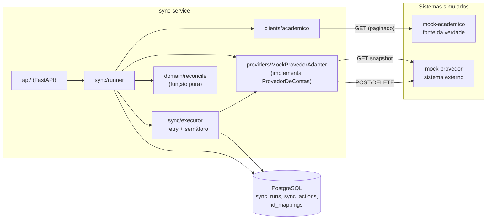
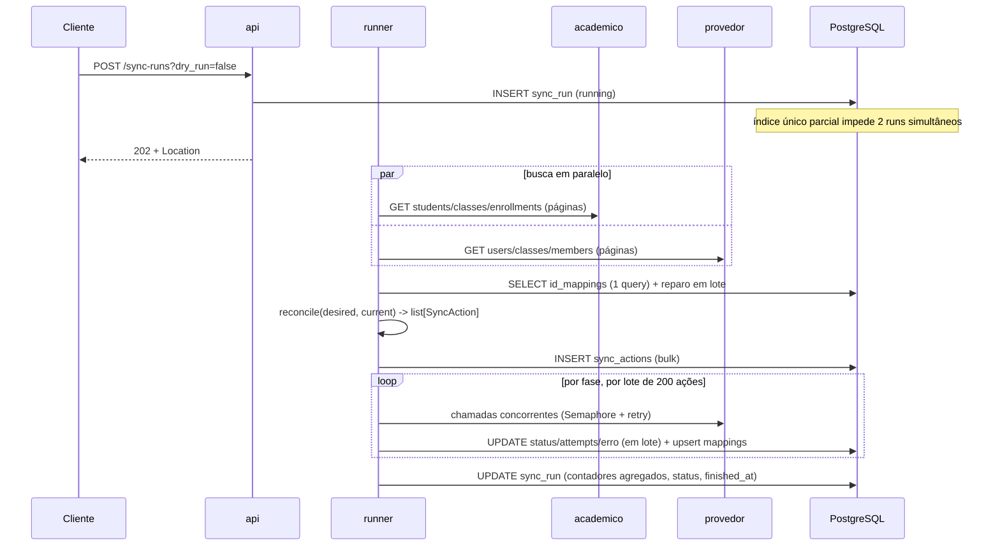
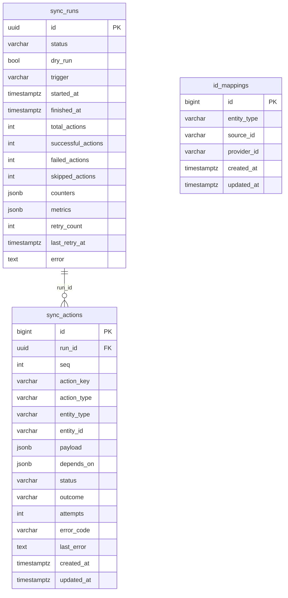

# edu-sync — Especificação técnica

> Status: proposta para aprovação. Nenhum código foi escrito.
> Objetivo: permitir que outra pessoa implemente o projeto sem tomar decisões arquiteturais fundamentais.


| # | Pergunta | Decisão adotada |
|---|---|---|
| 1 | Turmas por aluno | **Uma matrícula ativa por aluno.** Matrícula continua sendo entidade própria. Duas ativas para o mesmo aluno é dado inválido e falha a execução. |
| 2 | `POST /sync-runs` | Real: **assíncrono (202)**. Dry-run: **síncrono (200)** com o plano. |
| 3 | SQLAlchemy | **Async** (`asyncpg`). |
| 4 | Retry | **Implementação própria** (~40 linhas), sem `tenacity`. |
| 5 | Raiz do repositório | O **diretório atual é a raiz** (sem pasta `edu-sync/` aninhada). |

Mudanças de escopo em relação ao enunciado, todas justificadas adiante:

1. Ação extra `REACTIVATE_USER` (aluno suspenso que volta). Sem ela o aluno fica suspenso para sempre.
2. Suspender um usuário também remove suas matrículas nas turmas (`REMOVE_FROM_CLASS` antes de `SUSPEND_USER`).
3. Um "circuit breaker" simples (contador de falhas consecutivas) para o caso do provedor cair no meio da execução.
4. O provedor guarda `external_id` (o id do sistema acadêmico), o que torna o vínculo auto-reparável.

---

## 1. Arquitetura

### 1.1 Responsabilidades

**mock-academico** (porta 8001), fonte da verdade:
- Serve alunos, turmas e matrículas, com paginação.
- Gera o dataset com Faker na subida (seed determinístico: 4.000 alunos, 90 turmas).
- Injeta falhas configuráveis (500, 429, latência).
- Expõe `/_admin/*` para mutar o estado nos testes e demos (mover aluno, inativar aluno).
- **Não** conhece o provedor nem o sync. Estado em memória.

**mock-provedor** (porta 8002), sistema externo:
- Usuários, turmas e membros, com as regras de um provedor real: 409 em duplicatas, 422 ao matricular usuário suspenso, 429 por rate limit, 5xx ocasional, latência.
- Guarda `external_id` em usuários e turmas.
- Estado em memória: reiniciar o container equivale a um provedor vazio ("primeira sincronização").
- **Não** tem regra acadêmica.

**sync-service** (porta 8000), o produto:
- Busca os dois estados, reconcilia, planeja, executa com retry, audita e reprocessa.
- Expõe `/sync-runs`, persiste tudo no PostgreSQL.
- Tem o agendador diário (por último).

### 1.2 Fronteiras

- Serviços só se falam por **HTTP**. Nenhum importa código do outro em produção.
- Dentro do `sync-service`, as fronteiras são:
  - `domain/` é puro: sem I/O, sem relógio, sem aleatoriedade.
  - `providers/` e `clients/` são as únicas camadas que conhecem HTTP.
  - `db/` é a única que conhece SQL.
  - `sync/` orquestra as outras três.
- O motor (`sync/`) depende da interface `ProvedorDeContas`, nunca de `MockProvedorAdapter`.

### 1.3 Diagrama



### 1.4 Fluxo de dados de uma execução



---

## 2. Estrutura do monorepo

```text
.
├── services/
│   ├── mock-academico/
│   │   ├── Dockerfile
│   │   ├── pyproject.toml
│   │   ├── src/mock_academico/
│   │   │   ├── main.py            # app factory
│   │   │   ├── config.py          # Settings
│   │   │   ├── chaos.py           # middleware de falhas
│   │   │   ├── dataset.py         # Faker, seed determinístico
│   │   │   ├── store.py           # estado em memória
│   │   │   ├── schemas.py
│   │   │   ├── errors.py
│   │   │   └── routes/{students,classes,enrollments,admin}.py
│   │   └── tests/
│   ├── mock-provedor/
│   │   ├── Dockerfile
│   │   ├── pyproject.toml
│   │   ├── src/mock_provedor/
│   │   │   ├── main.py, config.py, chaos.py, store.py, schemas.py, errors.py
│   │   │   └── routes/{users,classes,members,admin}.py
│   │   └── tests/
│   └── sync-service/
│       ├── Dockerfile
│       ├── pyproject.toml
│       ├── alembic.ini
│       ├── alembic/{env.py, versions/0001_initial.py}
│       ├── src/sync_service/
│       │   ├── main.py            # app factory + lifespan
│       │   ├── config.py, logging.py, errors.py
│       │   ├── domain/{models.py, emails.py, reconcile.py}
│       │   ├── providers/{base.py, errors.py, mock_adapter.py}
│       │   ├── clients/{academico.py, pagination.py}
│       │   ├── resilience/{retry.py, rate_limit.py}
│       │   ├── db/{base.py, models.py, session.py}
│       │   ├── sync/{snapshot.py, runner.py, executor.py, store.py, scheduler.py}
│       │   └── api/{schemas.py, sync_runs.py, health.py}
│       └── tests/{unit, integration}
├── tests/
│   ├── contract/                  # adapter/cliente reais contra os mocks reais (in-process)
│   └── e2e/                       # contra docker compose
├── scripts/                       # benchmark.py
├── docs/{ESPECIFICACAO.md, adr/, benchmark.md}
├── .github/workflows/ci.yml
├── docker-compose.yml
├── .env.example
├── ruff.toml
├── Makefile                       # atalhos opcionais
├── .gitignore
└── README.md
```

### 2.1 Por que esta estrutura (e onde diverge da sugestão)

- **`services/` + `tests/` na raiz:** mantida. Separa o que é deploy independente (serviços) do que atravessa serviços (contrato, e2e).
- **Layout `src/` com pacotes de nomes únicos** (`mock_academico`, `mock_provedor`, `sync_service`), em vez de três pacotes chamados `app`. Motivo: os testes de contrato precisam importar os três no mesmo ambiente, e três `app` colidiriam.
- **Sem pacote compartilhado.** Os schemas dos mocks e os DTOs do sync são duplicados de propósito. Uma lib comum acoplaria os serviços e esconderia divergências de contrato. Quem guarda a coerência são os testes de contrato.
- **`chaos.py` duplicado nos dois mocks** (~60 linhas), pelo mesmo motivo.
- **Cada serviço tem seu `pyproject.toml` e seu Dockerfile.** Um único `ruff.toml` na raiz.
- **`scripts/`** só terá o benchmark: o seed vive dentro do `mock-academico`, onde é usado.
- **Ambiente de desenvolvimento único:** `pip install -e` dos três serviços num venv só. Nos containers, cada imagem instala só o seu.

---

## 3. Contratos HTTP

### 3.1 Convenções comuns

**Erro (todos os serviços):**
```json
{"error": {"code": "STRING_MAIUSCULA", "message": "texto humano", "details": {}}}
```
Erros de validação do FastAPI (422) são convertidos para esse envelope, com `code: "VALIDATION_ERROR"`.

**Paginação (toda listagem):** `?page=1&page_size=100`
- `page` ≥ 1, `page_size` entre 1 e 500, padrão 100. Fora disso: 422.
- Ordenação estável por chave primária crescente.
- Página além da última: 200 com `items: []`.

```json
{"items": [], "page": 1, "page_size": 100, "total": 4000}
```
Decisão: paginação por offset. É simples e determinística com dado estável. Limitação: se o dado mudar durante a leitura, pode haver item repetido ou perdido (documentar).

**Falhas injetadas (mocks):** 500 (`INJECTED_FAILURE`), 429 com header `Retry-After: <segundos inteiros>` (`RATE_LIMITED`). O provedor sorteia entre 500, 502, 503 e 504. `/health` e `/_admin/*` são isentos.

### 3.2 mock-academico

| Método | Path | Parâmetros | Resposta | Status |
|---|---|---|---|---|
| GET | `/students` | `page`, `page_size`, `status` (`active`\|`inactive`, opcional) | Página de `Student` | 200; 422; 429; 500 |
| GET | `/students/{id}` | — | `Student` | 200; 404 `STUDENT_NOT_FOUND`; 429; 500 |
| GET | `/classes` | `page`, `page_size` | Página de `Class` | 200; 422; 429; 500 |
| GET | `/classes/{id}` | — | `Class` | 200; 404 `CLASS_NOT_FOUND` |
| GET | `/enrollments` | `page`, `page_size`, `status` (`active`\|`ended`, opcional) | Página de `Enrollment` | 200; 422; 429; 500 |
| GET | `/health` | — | `{"status":"ok"}` | 200 |

```json
// Student
{"id": "STU-000001", "first_name": "João", "last_name": "da Silva", "status": "active"}
// Class
{"id": "CLS-001", "name": "7º Ano A", "year": 7}
// Enrollment
{"student_id": "STU-000001", "class_id": "CLS-001", "status": "active"}
```

O sync sempre usa `status=active`. Um aluno que sai deixa de aparecer nessa lista, e é assim que a "ausência no estado desejado" é observada.

**Admin (apenas mock, sem autenticação):**

| Método | Path | Efeito |
|---|---|---|
| PUT | `/_admin/chaos` | Corpo com os campos de `CHAOS_*`. Muda o comportamento em tempo de execução. Devolve a config atual. |
| POST | `/_admin/reset` | Recria o dataset a partir de `{students, classes, seed}` (opcional; senão usa o ambiente). |
| PATCH | `/_admin/students/{id}` | `{"status"?, "class_id"?}`. Inativa o aluno ou troca a turma (encerra a matrícula antiga, cria a nova). |
| POST | `/_admin/students` | Cria aluno com matrícula ativa em uma turma. |
| GET | `/_admin/stats` | Contadores de requisições (`total`, `by_route`, `by_status`). Usado no benchmark. |

### 3.3 mock-provedor

**Modelos:**
```json
// User
{"id": "usr_9f3a1c2b77aa", "external_id": "STU-000001", "email": "joao.silva@example.edu",
 "first_name": "João", "last_name": "da Silva", "status": "active", "created_at": "2026-01-01T00:00:00Z"}
// Class
{"id": "cls_4b1e...", "external_id": "CLS-001", "name": "7º Ano A"}
// Member
{"user_id": "usr_...", "joined_at": "..."}
```
`status` do usuário: `active` | `suspended`.

| Método | Path | Request / params | Sucesso | Erros |
|---|---|---|---|---|
| POST | `/users` | `{external_id, email, first_name, last_name}` (todos obrigatórios) | 201 `User` | 409 `USER_ALREADY_EXISTS` com `details:{conflict_field:"external_id"\|"email", existing_id}`; 422; 429; 5xx |
| GET | `/users` | `page`, `page_size`, `status?` | 200 página de `User` | 422; 429; 5xx |
| GET | `/users/{id}` | — | 200 `User` | 404 `USER_NOT_FOUND` |
| POST | `/users/{id}/suspend` | — | 200 `User` (idempotente: já suspenso devolve 200) | 404 `USER_NOT_FOUND` |
| POST | `/users/{id}/reactivate` | — | 200 `User` (idempotente) | 404 `USER_NOT_FOUND` |
| POST | `/classes` | `{external_id, name}` | 201 `Class` | 409 `CLASS_ALREADY_EXISTS` (`details.existing_id`); 422 |
| GET | `/classes` | `page`, `page_size` | 200 página de `Class` | — |
| GET | `/classes/{id}` | — | 200 `Class` | 404 `CLASS_NOT_FOUND` |
| GET | `/classes/{class_id}/members` | `page`, `page_size` | 200 página de `Member` | 404 `CLASS_NOT_FOUND` |
| POST | `/classes/{class_id}/members` | `{user_id}` | 201 `Member` | 404 `CLASS_NOT_FOUND`/`USER_NOT_FOUND`; 409 `MEMBERSHIP_ALREADY_EXISTS`; **422 `USER_SUSPENDED`** |
| DELETE | `/classes/{class_id}/members/{user_id}` | — | 204 | 404 `CLASS_NOT_FOUND`; 404 `MEMBERSHIP_NOT_FOUND` |
| GET | `/health` | — | 200 | — |

Regras:
- No `POST /users`, o `external_id` é verificado **antes** do e-mail. Se ambos conflitam, `conflict_field` é `external_id`.
- Códigos distintos de 404 (`CLASS_NOT_FOUND` vs `MEMBERSHIP_NOT_FOUND`) permitem ao adapter decidir se o 404 é "recurso inexistente esperado" (já removido) ou erro real.
- Listagem de membros é **por turma** (como um provedor real). O snapshot custa 1 chamada por turma (mais páginas), um número limitado pela quantidade de turmas (~90), não por alunos.
- Admin: `PUT /_admin/chaos`, `POST /_admin/reset`, `GET /_admin/stats` (mesmo formato do acadêmico).

### 3.4 sync-service

**Modelos:**
```json
// RunSummary
{"id": "uuid", "status": "running|succeeded|partial|aborted|failed|interrupted|planned",
 "dry_run": false, "trigger": "manual|scheduled",
 "started_at": "...", "finished_at": null,
 "total_actions": 0, "successful_actions": 0, "failed_actions": 0, "skipped_actions": 0,
 "counters": {"CREATE_USER": 120, "ADD_TO_CLASS": 118},
 "metrics": {"fetch_desired_ms": 0, "fetch_current_ms": 0, "reconcile_ms": 0, "execute_ms": 0,
             "http_calls": {"academico": 0, "provedor": 0}, "retries": 0},
 "retry_count": 0, "error": null}
// Action
{"id": 1, "seq": 1, "action_key": "CREATE_USER:STU-000001", "action_type": "CREATE_USER",
 "entity_type": "user", "entity_id": "STU-000001", "payload": {}, "depends_on": [],
 "status": "pending|planned|succeeded|failed|skipped", "outcome": "applied|already_applied|null",
 "attempts": 0, "error_code": null, "last_error": null, "created_at": "...", "updated_at": "..."}
```

| Método | Path | Params | Resposta | Status |
|---|---|---|---|---|
| POST | `/sync-runs` | `dry_run` (bool, padrão `false`) | dry-run: `RunSummary` + `actions` (plano completo). Real: `RunSummary` com `status: running` e header `Location: /sync-runs/{id}` | **200** dry-run; **202** real; **409** `RUN_IN_PROGRESS` (`details.run_id`); **502** `UPSTREAM_UNAVAILABLE` (dry-run cujo fetch falhou; `details.run_id`) |
| GET | `/sync-runs` | `page`, `page_size`, `status?`, `dry_run?` | Página de `RunSummary`, mais recentes primeiro | 200; 422 |
| GET | `/sync-runs/{run_id}` | — | `RunSummary` | 200; 404 `RUN_NOT_FOUND`; 422 (UUID inválido) |
| GET | `/sync-runs/{run_id}/actions` | `page`, `page_size`, `status?`, `action_type?` | Página de `Action`, ordenada por `seq` | 200; 404; 422 |
| POST | `/sync-runs/{run_id}/retry-failed` | — | `RunSummary` | **202** reprocessando; **200** nada a reprocessar (no-op idempotente); 404; **409** `RUN_IN_PROGRESS` ou `RUN_IS_DRY_RUN` |
| GET | `/health` | — | `{"status":"ok","db":"ok"}` | 200; 503 se o banco não responde |

Comportamentos:
- **Um único run real por vez.** Garantido no banco (seção 8). O dry-run não bloqueia nem é bloqueado.
- **Dry-run** persiste run (`planned`) e ações (`planned`) para auditoria, e devolve o plano inteiro embutido. O plano pode chegar a alguns MB no cenário de 4.000 alunos. Aceitável; a paginação em `/actions` existe para o restante.
- **Falha ao buscar estado** num run assíncrono: o run vira `failed` com `error` preenchido. Nenhuma ação é executada.
- **`retry-failed`** seleciona as ações reprocessáveis (seção 6.5), não recalcula o plano e reaproveita o mesmo run.

---

## 4. Domínio

### 4.1 Onde cada tipo vive

- **Domínio** (`domain/models.py`): `@dataclass(frozen=True, slots=True)`. Leves, imutáveis, sem validação de I/O.
- **Pydantic:** apenas nas bordas (DTOs HTTP, schemas da API, `Settings`).
- **ORM** (`db/models.py`): só persistência. O domínio não importa SQLAlchemy.

### 4.2 Entidades

**Estado desejado (vem do acadêmico):**

| Entidade | Campos | Notas |
|---|---|---|
| `Student` | `id`, `first_name`, `last_name` | Só alunos `active` entram. Ausência = não desejado. |
| `Class` | `id`, `name` | |
| `Enrollment` | `student_id`, `class_id` | Só ativas. |
| `DesiredState` | `students: dict[id, Student]`, `classes: dict[id, Class]`, `enrollments: frozenset[(student_id, class_id)]` | |

Validação na construção (`InvalidDesiredState`): matrícula referenciando aluno/turma inexistente no estado; aluno com mais de uma matrícula ativa. A execução falha (fail-fast) em vez de adivinhar.

**Estado atual (vem do provedor, já traduzido para ids de origem):**

| Entidade | Campos |
|---|---|
| `ProviderUser` | `source_id` (= `external_id`), `email`, `status` (`active`\|`suspended`) |
| `ProviderClass` | `source_id`, `name` |
| `CurrentState` | `users: dict[source_id, ProviderUser]`, `classes: dict[source_id, ProviderClass]`, `memberships: frozenset[(student_source_id, class_source_id)]`, `reserved_emails: frozenset[str]` |

- **Só entra em `CurrentState` o que é gerenciado**, ou seja, tem `external_id`. Usuários/turmas do provedor sem `external_id` ("órfãos") nunca geram ação.
- `reserved_emails` contém **todos** os e-mails do provedor, inclusive de suspensos e órfãos, em minúsculas. Isso evita colisão e mantém a regra determinística ao longo do tempo.

**Ação (`SyncAction`):** `type`, `entity_type`, `entity_id`, `key`, `payload: dict`, `depends_on: tuple[str, ...]`.

Tipos: `CREATE_CLASS`, `CREATE_USER`, `REACTIVATE_USER`, `REMOVE_FROM_CLASS`, `ADD_TO_CLASS`, `SUSPEND_USER`.
**Não existe** `DELETE_USER`: a ausência do tipo é a garantia de que nunca apagamos.

`key = f"{type}:{entity_id}"`. `entity_id` de membership é `"{student_id}|{class_id}"`.

| Tipo | `entity_type` | Payload |
|---|---|---|
| `CREATE_CLASS` | `class` | `{class_source_id, name}` |
| `CREATE_USER` | `user` | `{student_source_id, first_name, last_name, email}` |
| `REACTIVATE_USER` | `user` | `{student_source_id}` |
| `SUSPEND_USER` | `user` | `{student_source_id}` |
| `ADD_TO_CLASS` / `REMOVE_FROM_CLASS` | `membership` | `{student_source_id, class_source_id}` |

Os payloads carregam **ids de origem**. Ids do provedor são resolvidos na execução (seção 4.3).

### 4.3 Mapeamento de ids

Há dois mecanismos, com papéis diferentes:

1. **`external_id` no provedor:** o vínculo durável e auto-reparável. Guarda o id do acadêmico dentro do próprio usuário/turma.
2. **Tabela `id_mappings` no sync:** um índice local e auditável `source_id ↔ provider_id`, com unicidade nos dois sentidos. Serve para resolver ids na execução sem consultar o provedor a cada ação.

Regras:
- Um passo de **reparo** roda antes do `reconcile`: para cada usuário/turma do snapshot com `external_id` sem mapping, faz upsert em lote.
- Se um mapping local aponta para um `provider_id` que não existe mais no snapshot, ele é ignorado e o item é tratado como "não existe" (será recriado).
- Um provedor real (Google) pode não permitir `external_id` arbitrário. Nesse caso `id_mappings` passa a ser a única fonte do vínculo. O desenho já prevê isso.

### 4.4 Relacionamentos

- Aluno 1—0..1 Usuário do provedor (via `external_id`/`id_mappings`).
- Turma 1—0..1 Turma do provedor.
- Matrícula liga Aluno e Turma. No provedor é um membro da turma.
- `SyncRun` 1—N `SyncAction`. `IdMapping` é independente das execuções (é estado, não histórico).

---

## 5. Algoritmo de reconciliação

```text
reconcile(desired: DesiredState, current: CurrentState) -> list[SyncAction]
```

Função pura, síncrona, O(n). Sem I/O, relógio ou aleatoriedade. Não modifica os argumentos.

### 5.1 Passos

Sejam `D_users` = `desired.students` (todos ativos) e `desired_class[s]` = a turma da matrícula de `s`.

1. **Turmas novas.** Para cada `c` em `desired.classes` (ordem por id) ausente em `current.classes`: `CREATE_CLASS`.
2. **Alunos novos.** Para cada `s` em `D_users` (ordem por id) ausente em `current.users`: `CREATE_USER` com e-mail alocado (5.3).
3. **Alunos que voltaram.** Para cada `s` em `D_users` presente em `current.users` com `status = suspended`: `REACTIVATE_USER`.
4. **Matrículas a remover.** Para cada par `(s, c)` em `current.memberships` tal que:
   - `(s, c)` não está em `desired.enrollments` (troca de turma, ou aluno saiu, ou matrícula encerrada) → `REMOVE_FROM_CLASS`.
5. **Matrículas a adicionar.** Para cada par em `desired.enrollments` que não está em `current.memberships` → `ADD_TO_CLASS`.
6. **Alunos que saíram.** Para cada `u` em `current.users` com `status = active` e `u.source_id` fora de `D_users` → `SUSPEND_USER`.

Uma vez que o aluno saiu, o passo 4 já emitiu a remoção de todas as suas turmas (o par não está em `desired.enrollments`). Assim, a suspensão sempre vem depois de o usuário ficar sem turmas.

### 5.2 Ordem de saída e dependências

Fases (a lista final é ordenada por fase e, dentro da fase, por `key`, o que garante determinismo):

| Fase | Ações | `depends_on` |
|---|---|---|
| 0 | `CREATE_CLASS` | — |
| 1 | `CREATE_USER`, `REACTIVATE_USER` | — |
| 2 | `REMOVE_FROM_CLASS` | — |
| 3 | `ADD_TO_CLASS` | `CREATE_USER:{s}` / `REACTIVATE_USER:{s}` / `CREATE_CLASS:{c}`, quando essas ações estão no plano |
| 4 | `SUSPEND_USER` | — |

Por que essa ordem:
- Remover antes de adicionar: numa troca de turma, o aluno nunca fica em duas turmas.
- Reativar antes de adicionar: o provedor devolve 422 `USER_SUSPENDED` ao matricular um suspenso.
- Remover antes de suspender: o mesmo motivo, ao contrário. Um suspenso não deve manter turmas.

### 5.3 E-mail institucional (`domain/emails.py`)

`gerar_local(first_name, last_name)`:
1. Normalizar com NFKD, remover diacríticos, minúsculas.
2. `nome` = primeiro token de `first_name`. `sobrenome` = último token de `last_name`.
3. Remover tudo que não seja `[a-z0-9]` de cada parte.
4. Local = `nome.sobrenome`. Se qualquer parte ficar vazia: `aluno{source_id normalizado}`.
5. Truncar em 64 caracteres (reservando espaço para o sufixo).

Alocação: alunos novos em ordem crescente de `source_id`. Para cada um, testar `local@example.edu`, depois `local2@…`, `local3@…`, até achar um e-mail fora de `reserved_emails ∪ já alocados nesta chamada` (comparação em minúsculas). O sufixo é concatenado direto (`joao.silva2`), sem separador.

Propriedades:
- **Determinístico:** mesma entrada, mesma saída.
- **Estável:** o e-mail é alocado só na criação e nunca recalculado. Um aluno existente mantém o e-mail, mesmo que outros entrem depois.
- **Domínio configurável:** `EMAIL_DOMAIN` (padrão `example.edu`), passado como argumento (a função continua pura).

### 5.4 Casos

| Caso | Resultado |
|---|---|
| Aluno novo | `CREATE_USER` + `ADD_TO_CLASS` (+ `CREATE_CLASS` se a turma também é nova) |
| Aluno existente, nada mudou | Nenhuma ação |
| Mudança de turma A→B | `REMOVE_FROM_CLASS A`, `ADD_TO_CLASS B` |
| Aluno removido | `REMOVE_FROM_CLASS` (por turma) + `SUSPEND_USER` |
| Aluno suspenso que reaparece | `REACTIVATE_USER` + `ADD_TO_CLASS` |
| Turma nova | `CREATE_CLASS` (antes de qualquer `ADD_TO_CLASS` para ela) |
| Colisão de e-mail | Sufixo incremental (5.3) |
| Nenhuma mudança | `[]` |
| Usuário/turma órfão no provedor | Ignorado (só entra em `reserved_emails`) |

### 5.5 Invariantes

Cada uma vira teste.

1. **Pureza:** as entradas não são modificadas; sem I/O.
2. **Determinismo:** mesma entrada, mesma lista, na mesma ordem.
3. **Convergência (idempotência):** se `apply(plan, current)` produz `current'`, então `reconcile(desired, current') == []`.
4. **Nunca apaga:** não existe ação de exclusão de usuário.
5. **Dependências antes:** toda ação aparece depois das ações em `depends_on`.
6. **Chaves únicas:** não há duas ações com a mesma `key`.
7. **E-mails únicos:** nenhum e-mail alocado repete outro reservado ou alocado (sem diferenciar maiúsculas).
8. **Não interferência:** entidades sem `external_id` nunca geram ação.
9. **Exclusividade:** após o plano, cada aluno ativo está exatamente na turma desejada.
10. **Suspenso sem turma:** após o plano, aluno suspenso não pertence a nenhuma turma.
11. **Minimalidade:** nenhuma ação cujo efeito já esteja satisfeito em `current`.

---

## 6. Idempotência

### 6.1 Do algoritmo
`reconcile` compara **estados**, não replica comandos. Se o estado atual já é o desejado, a saída é `[]`. Garantida pelo invariante 3 e por um teste que aplica o plano num `CurrentState` simulado em memória e reconcilia de novo, com casos aleatórios semeados.

### 6.2 Do serviço
- Duas execuções seguidas sobre o mesmo estado: a 1ª faz as ações necessárias, a 2ª tem `total_actions = 0` e status `succeeded`.
- O plano nunca é lido de execuções anteriores: sempre é recalculado a partir do estado observado. Não há "ações pendentes" acumuladas que possam duplicar.
- Um único run real por vez (índice parcial único, seção 8), para dois cálculos concorrentes não gerarem o mesmo plano.

### 6.3 Das chamadas ao provedor
Cada chamada é segura de repetir, e é isso que torna o retry seguro (uma requisição pode ter sido aplicada mesmo com timeout na resposta). O adapter traduz o resultado em `Outcome`:

| Operação | Resposta | Interpretação |
|---|---|---|
| `create_user` / `create_class` | 201 | `APPLIED` |
| | 409 com `conflict_field = external_id` | `ALREADY_APPLIED`. Adota `existing_id` e grava o mapping. |
| | 409 com `conflict_field = email` | Erro permanente `EMAIL_CONFLICT` (o e-mail alocado ficou obsoleto). A ação falha. |
| `add_member` | 201 | `APPLIED` |
| | 409 `MEMBERSHIP_ALREADY_EXISTS` | `ALREADY_APPLIED` |
| `remove_member` | 204 | `APPLIED` |
| | 404 `MEMBERSHIP_NOT_FOUND` | `ALREADY_APPLIED` |
| | 404 `CLASS_NOT_FOUND` | Erro permanente |
| `suspend_user` / `reactivate_user` | 200 (mesmo se já estava) | `APPLIED` |

`ALREADY_APPLIED` conta como sucesso e é registrado em `outcome` para auditoria.

### 6.4 Da persistência
- `id_mappings`: `INSERT … ON CONFLICT DO UPDATE` (upsert) e duas restrições `UNIQUE`.
- `sync_actions`: `UNIQUE (run_id, action_key)`. Reprocessar atualiza as mesmas linhas, sem criar novas.
- Atualizações de status são `UPDATE … WHERE id = …`, então repetir é seguro.
- Os contadores do run são recalculados por agregação (`GROUP BY status`) sobre `sync_actions`, sem contagem em memória que possa divergir.

### 6.5 Reprocessamento (`retry-failed`)
Ações reprocessáveis:
- `status = failed`;
- `status = skipped` com `error_code ∈ {DEPENDENCY_FAILED, RUN_ABORTED}`;
- `status = pending` (só existe em run `interrupted`).

Ações `succeeded` nunca são tocadas. Como o plano não é recalculado, o retry executa o que foi planejado. Por isso vale rodar um novo sync depois. Ele é seguro porque as chamadas são idempotentes (6.3).

---

## 7. Retry

### 7.1 Onde
`resilience/retry.py` fornece `retry_async(operation, policy, *, sleep, rng)`, com `sleep` e `rng` injetáveis para testes determinísticos. É aplicado em duas unidades, ambas idempotentes:
- **uma ação de sincronização** (executor), e `attempts` da ação vem daí;
- **uma página de listagem** (clientes de snapshot).

O adapter classifica os erros e o retry só decide por tipo de exceção. Assim o motor nunca vê HTTP.

### 7.2 Classificação

| Categoria | Casos | Exceção do adapter |
|---|---|---|
| **Transitório (retry)** | HTTP 408, 429, 500, 502, 503, 504; `ConnectError`, `ConnectTimeout`, `ReadTimeout`, `WriteTimeout`, `PoolTimeout`, `RemoteProtocolError` | `TransientProviderError(retry_after)` |
| **Permanente (sem retry)** | 400, 401, 403, 422, demais 4xx, 404 não esperado | `PermanentProviderError(code, message)` |
| **Semântico (vira sucesso)** | 409 `external_id`, 409 membership, 404 `MEMBERSHIP_NOT_FOUND` | não é exceção (6.3) |

### 7.3 Política (padrões, configuráveis por ambiente)

| Parâmetro | Padrão | Variável |
|---|---|---|
| Tentativas totais (1ª + retries) | **5** | `RETRY_MAX_ATTEMPTS` |
| Atraso base | 0,5 s | `RETRY_BASE_DELAY_SECONDS` |
| Fator | 2 | `RETRY_FACTOR` |
| Teto do atraso | 30 s | `RETRY_MAX_DELAY_SECONDS` |
| Jitter | `full` (ou `none`, para testes) | `RETRY_JITTER` |
| Orçamento total por operação | 120 s | `RETRY_MAX_ELAPSED_SECONDS` |

- Teto do atraso na tentativa `n`: `cap = min(max_delay, base × factor^(n-1))` → 0,5 / 1 / 2 / 4 s.
- **Full jitter:** `sleep = uniform(0, cap)`. Evita que muitos workers acordem juntos.
- **`Retry-After`:** se presente (429/503), `sleep = max(sleep, retry_after)`, limitado a 60 s.
- Timeouts HTTP: conexão 3 s, leitura 10 s, escrita 10 s, pool 5 s.

### 7.4 Ao esgotar
- Lança `RetriesExhausted` (com o último erro). A ação vira `failed`, com `error_code = RETRIES_EXHAUSTED`, `attempts` e `last_error`.
- O run **continua**. Falha de uma ação não interrompe as demais.
- Erros permanentes falham na 1ª tentativa (`attempts = 1`), com `error_code` vindo do provedor (por exemplo `USER_SUSPENDED`).

### 7.5 Provedor caindo no meio (circuit breaker mínimo)
Sem proteção, 4.000 ações × 5 tentativas × backoff fariam o run durar horas contra um provedor morto.
- Contador de falhas **consecutivas** com `RETRIES_EXHAUSTED`, avaliado após cada lote. Zera em qualquer sucesso.
- Ao atingir `MAX_CONSECUTIVE_FAILURES` (padrão **25**): o executor para, as ações restantes viram `skipped` com `error_code = RUN_ABORTED`, e o run termina como `aborted`.
- `retry-failed` retoma depois. Nada foi perdido e tudo é idempotente.

---

## 8. Banco de dados

PostgreSQL 16, SQLAlchemy 2 async, Alembic.



### 8.1 Tabelas

**`sync_runs`**
- `id` UUID (gerado na aplicação). Aparece na API, então não deve ser sequencial adivinhável.
- `status` VARCHAR(16) NOT NULL + `CHECK` em `('running','succeeded','partial','aborted','failed','interrupted','planned')`.
- `trigger` VARCHAR(16) NOT NULL + `CHECK ('manual','scheduled')`.
- `dry_run` BOOLEAN NOT NULL; `started_at` TIMESTAMPTZ NOT NULL; `finished_at` TIMESTAMPTZ NULL (nula enquanto `running`).
- Contadores `INTEGER NOT NULL DEFAULT 0`, com `CHECK (>= 0)`.
- `counters` JSONB (por tipo de ação planejada), `metrics` JSONB (tempos e chamadas HTTP), `error` TEXT.
- **Índices:**
  - `(started_at DESC)`, para listagem.
  - **Único parcial** que garante um run real por vez:
    `CREATE UNIQUE INDEX ux_sync_runs_single_running ON sync_runs ((true)) WHERE status = 'running' AND dry_run = false;`
    O segundo `INSERT` falha com `IntegrityError`, traduzido para 409 `RUN_IN_PROGRESS`.

**`sync_actions`**
- `id` BIGINT identity; `run_id` UUID NOT NULL FK → `sync_runs(id)` `ON DELETE CASCADE`.
- `seq` INTEGER NOT NULL (ordem de execução).
- `action_key` VARCHAR(200) NOT NULL; `action_type`, `entity_type`: VARCHAR + `CHECK`. `entity_id` VARCHAR(128).
- `payload` JSONB NOT NULL; `depends_on` JSONB NOT NULL DEFAULT `'[]'`.
- `status` VARCHAR(16) + `CHECK ('planned','pending','succeeded','failed','skipped')`; `outcome` VARCHAR(16) NULL (`applied`/`already_applied`).
- `attempts` INTEGER NOT NULL DEFAULT 0; `error_code` VARCHAR(64) NULL; `last_error` TEXT NULL.
- `created_at`, `updated_at` TIMESTAMPTZ NOT NULL DEFAULT `now()`.
- **Constraints:** `UNIQUE (run_id, action_key)`, `UNIQUE (run_id, seq)`.
- **Índices:** `(run_id, status)` (busca de falhas e progresso) e `(entity_type, entity_id)` (histórico de uma entidade).

**`id_mappings`**
- `id` BIGINT identity; `entity_type` VARCHAR(16) + `CHECK ('user','class')`; `source_id`, `provider_id` VARCHAR(64) NOT NULL.
- `created_at`, `updated_at`.
- **Constraints:** `UNIQUE (entity_type, source_id)` e `UNIQUE (entity_type, provider_id)`, para impedir mapeamento duplicado nos dois sentidos.
- Matrículas não têm mapping: são o par de ids já mapeados.

### 8.2 Decisões de modelagem

- **Enum nativo vs string:** `VARCHAR` + `CHECK`. Enums nativos do PostgreSQL são difíceis de alterar em migrations (`ALTER TYPE`, limitações em transação) e o Alembic os trata mal. No código, `StrEnum` mantém a segurança de tipos.
- **JSONB:** só para dados semiestruturados e que não são filtrados com frequência (`payload`, `counters`, `metrics`, `depends_on`). Tudo que filtramos ou agregamos (`status`, `action_type`, `entity_id`) é coluna normal.
- **Timestamps:** sempre `TIMESTAMPTZ` em UTC. `created_at` com default no servidor, `updated_at` atualizado pelo ORM.
- **Foreign keys:** só `sync_actions → sync_runs`. `id_mappings` não tem FK: é estado global, não pertence a uma execução.
- **Retenção:** sem limpeza automática (limitação documentada). Uma execução diária de ~8.000 ações gera ~3 milhões de linhas/ano, aceitável para o escopo.
- **Nomes de constraints** padronizados via `naming_convention` no `MetaData`, para migrations estáveis.
- **Alembic:** `env.py` async; migration `0001_initial` escrita/revisada à mão (não confiar cegamente no autogenerate).
- **N+1:** mappings carregados em 1 `SELECT`; ações inseridas em lote (`INSERT … VALUES` múltiplos, em blocos de 1.000); status atualizados em lote por bloco; contadores por 1 agregação. Nenhuma query por aluno.

---

## 9. Concorrência

`AsyncSession` **não é segura para uso concorrente**, então workers só fazem HTTP e devolvem resultados. Quem grava no banco é uma única rotina.

| Onde | Concorrência | Como |
|---|---|---|
| Busca do estado desejado × atual | **Sim** | `asyncio.gather` entre os dois lados |
| Páginas de uma listagem | **Sim, limitada** | 1ª página sequencial (descobre `total`), restantes concorrentes com `Semaphore(SNAPSHOT_CONCURRENCY=5)` |
| Membros por turma (~90 chamadas) | **Sim, limitada** | Mesmo semáforo |
| Execução das ações **dentro de uma fase** | **Sim, limitada** | `Semaphore(PROVIDER_CONCURRENCY=10)` |
| Persistência dos resultados | **Não** | Uma rotina; grava em lote a cada lote de 200 ações |
| **Entre fases** | **Não** (barreira) | Fase N+1 só começa quando a N terminou. As dependências vêm daí |
| `reconcile` e alocação de e-mails | **Não** | Síncrono, CPU leve, ordem determinística necessária |
| Um run por vez | **Não** | Índice único parcial |

**Execução em lotes:** dentro da fase, as ações são divididas em lotes de 200. Cada lote roda concorrente (limitado pelo semáforo), depois seus resultados são gravados de uma vez. Depois disso, avalia-se o circuit breaker. O lote é a unidade de persistência e de retomada, a um custo pequeno em vazão.

**Rate limit:**
- O semáforo limita **simultaneidade**, não **taxa**. Por isso há também um limitador simples (`resilience/rate_limit.py`, intervalo mínimo entre chamadas) com `PROVIDER_MAX_RPS` (padrão 50).
- Se mesmo assim vier 429, o retry respeita o `Retry-After`.
- Os padrões são um ponto de partida: os valores finais saem do benchmark real, não de suposição.

**Dependências entre ações:** antes de executar uma ação, o executor consulta o status das ações em `depends_on` (um único `SELECT` por run, mantido em memória e atualizado). Se alguma não estiver `succeeded`, a ação vira `skipped` com `DEPENDENCY_FAILED`, evitando erros em cascata difíceis de interpretar.

**Execução assíncrona do run:** `asyncio.create_task` no mesmo processo. Ao subir, o serviço marca qualquer run `running` restante como `interrupted` (o processo caiu). Limitação documentada: um restart interrompe o run em andamento, e `retry-failed` o retoma.

---

## 10. Testes

Ferramentas: `pytest`, `pytest-asyncio`, `respx`, `httpx.ASGITransport` (para rodar os mocks em processo), PostgreSQL real.

### 10.1 Matriz

| Nível | O que cobre | Onde | Dependências |
|---|---|---|---|
| **Unitário: domínio** | Aluno novo; aluno removido; troca de turma; turma nova; colisão de e-mail (2, 3, sufixos); nenhuma mudança; aluno que volta; órfãos ignorados; matrícula inválida (`InvalidDesiredState`); ordem/dependências; invariantes 1–11 | `sync-service/tests/unit/domain` | Nenhuma |
| **Unitário: e-mail** | Acentos, sobrenomes compostos, nome vazio, truncamento, determinismo, caixa | idem | Nenhuma |
| **Unitário: retry** | Sequência de atrasos, teto, jitter com `rng` fixo, `Retry-After`, orçamento de tempo, esgotamento | `tests/unit/resilience` | `sleep`/`rng` falsos |
| **Unitário: mocks** | Paginação (limites, página vazia, total), 409/404/422 do provedor, chaos com seed | `services/mock-*/tests` | ASGITransport |
| **Adapter (respx)** | 429→sucesso (retry); 500→502→sucesso; 400 sem retry; 422 sem retry; 409 `external_id` → `ALREADY_APPLIED`; 409 `email` → erro permanente; 404 `MEMBERSHIP_NOT_FOUND` → `ALREADY_APPLIED`; timeout → retry; `Retry-After` respeitado | `sync-service/tests/unit/providers` | `respx` |
| **Integração (PG real)** | `alembic upgrade head`; upsert de mapping; `UNIQUE` de mapping duplicado falha; índice de run único; cascata; agregação de contadores; sem N+1 (contar queries por execução) | `sync-service/tests/integration` | PostgreSQL |
| **Integração: fluxo** | Dry-run não faz nenhuma escrita no provedor e persiste `planned`; sync completo; falha parcial (3 de N); `retry-failed` só toca falhas; dependência falha → `skipped`; run `interrupted` na subida | idem | PG + mocks em processo |
| **Contrato** | Cliente do acadêmico e `MockProvedorAdapter` reais contra os **mocks reais** em processo: formatos, paginação, códigos de erro, `external_id` | `tests/contract` | Mocks importados |
| **Idempotência** | (a) `reconcile` sobre o resultado simulado devolve `[]`; (b) serviço: 2 execuções seguidas → 1ª com ações, **2ª com `total_actions = 0`**; (c) repetir `retry-failed`; (d) reenviar `CREATE_USER` após timeout simulado → 409 adotado | unit + integration | PG + mocks |
| **Resiliência** | Provedor derruba no meio (chaos): o run termina `partial`; provedor morto: circuit breaker → `aborted` + `skipped RUN_ABORTED`; `retry-failed` conclui depois que o provedor volta | integration | PG + mocks com chaos |
| **E2E** | `docker compose up` com dataset pequeno: dry-run → sync → 2ª execução vazia → mutação no acadêmico (`/_admin`) → sync → verificação no provedor | `tests/e2e` (marcador `e2e`) | Docker |
| **Escala (manual)** | 4.000 alunos/90 turmas, métricas reais | `scripts/benchmark.py` | Docker |

### 10.2 Regras dos testes
- Determinísticos: `CHAOS_SEED` fixo, `sleep` injetado (nada de espera real), Faker com seed.
- **PostgreSQL real em teste e no CI** (`services: postgres` no GitHub Actions; local via compose). Sem SQLite.
- Banco de teste separado, recriado com migrations (`alembic upgrade head`), limpo (`TRUNCATE`) entre testes.
- CI: jobs de `lint` (ruff check + format), `unit`, `integration` (com PG) e `e2e` (com compose).

---

## 11. O que deliberadamente NÃO fazer

- Arquitetura hexagonal completa, DDD tático (aggregates, value objects, domain events), CQRS, event sourcing.
- Repositórios genéricos (`Repository[T]`), Unit of Work, factories e containers de injeção de dependência. Funções de `sync/store.py` com uma `AsyncSession` bastam.
- Filas e workers: Redis, RabbitMQ, Celery, Kafka (fica para o Projeto 3, decisão documentada).
- Biblioteca compartilhada entre serviços; geração de clientes a partir de OpenAPI.
- Autenticação/autorização, multi-tenant, rate limit por cliente nos mocks.
- Frontend, painel, websockets/SSE para progresso (basta `GET /sync-runs/{id}`).
- Integração real com Google ou OAuth.
- Cache, otimização prematura, pool de conexões customizado; tuning só depois de medir.
- Circuit breaker completo (half-open, métricas, biblioteca). O contador simples da seção 7.5 basta.
- Observabilidade pesada (OpenTelemetry, Prometheus, Grafana). Logs JSON e as métricas guardadas no run bastam.
- Pipeline de deploy, Kubernetes, Terraform.
- Sincronizar atualizações de nome/e-mail (`UPDATE_USER`), arquivar turmas ou sincronizar entre múltiplas escolas: fora do escopo, listadas como limitações.
- Delta/sync incremental por eventos: a reconciliação completa periódica é a decisão.
- Mais de um formato de erro, versionamento de API (`/v1`).

---

## 12. Ordem de implementação

Cada etapa termina com testes passando e `ruff` limpo.

**E0. Bootstrap**
- Objetivo: repositório navegável e CI mínimo.
- Arquivos: `ruff.toml`, `.gitignore`, `.env.example`, `docker-compose.yml` (só PostgreSQL), `.github/workflows/ci.yml` (lint), `README.md` (esqueleto), pastas dos serviços com `pyproject.toml`.
- Dependências: nenhuma.
- Testes: um teste "fumaça" por serviço.
- Aceite: `ruff check` limpo; `docker compose up postgres` saudável; CI de lint verde.

**E1. Domínio: modelos e e-mails**
- Arquivos: `domain/models.py`, `domain/emails.py`.
- Dependências: E0.
- Testes: unitários de e-mail (acentos, colisão, truncamento, determinismo).
- Aceite: `joao.silva`, `joao.silva2`, `joao.silva3` reproduzíveis.

**E2. Domínio: reconciliação**
- Arquivos: `domain/reconcile.py`.
- Dependências: E1.
- Testes: os 6 casos obrigatórios + aluno que volta, órfãos, ordem, e propriedade de convergência (invariantes 1–11).
- Aceite: todos passam, sem importar HTTP nem banco (verificável pelos imports).

**E3. mock-provedor (sem chaos)**
- Arquivos: `mock_provedor/{main,config,store,schemas,errors}.py`, `routes/*`.
- Dependências: E0.
- Testes: contrato de cada endpoint, 409/404/422, paginação.
- Aceite: todos os endpoints da seção 3.3 respondem conforme a tabela.

**E4. mock-academico + dataset**
- Arquivos: `mock_academico/{main,config,dataset,store,schemas,errors}.py`, `routes/*`.
- Dependências: E0.
- Testes: paginação; seed determinístico (mesmo seed, mesmos dados); 4.000/90 gerados em tempo razoável; `_admin` de mutação.
- Aceite: `GET /students?status=active` pagina 4.000 alunos; cada aluno ativo tem exatamente 1 matrícula ativa.

**E5. Chaos nos dois mocks**
- Arquivos: `chaos.py` (×2), rotas `_admin/chaos` e `_admin/stats`.
- Dependências: E3, E4.
- Testes: taxa de erro com seed, 429 com `Retry-After`, latência dentro da faixa, isenção de `/health`.
- Aceite: com `CHAOS_ERROR_RATE=1.0` todo request de negócio falha; com 0.0 nenhum.

**E6. Resiliência**
- Arquivos: `resilience/retry.py`, `resilience/rate_limit.py`.
- Dependências: E0.
- Testes: unitários de retry (7.3) e do limitador.
- Aceite: atrasos e esgotamento conforme a política, sem esperas reais.

**E7. Clientes e adapter**
- Arquivos: `clients/{academico,pagination}.py`, `providers/{base,errors,mock_adapter}.py`.
- Dependências: E2, E3, E4, E6.
- Testes: `respx` (429→ok, 400 sem retry, 409/404 mapeados, timeout) e contrato contra os mocks reais.
- Aceite: as tabelas 6.3 e 7.2 são verdadeiras nos testes.

**E8. Banco**
- Arquivos: `db/{base,models,session}.py`, `alembic/`, `sync/store.py` (parte de mappings).
- Dependências: E0.
- Testes: integração em PG real: migration, constraints, índice de run único, upsert.
- Aceite: `alembic upgrade head` e `downgrade base` funcionam; duplicatas são rejeitadas pelo banco.

**E9. Dry-run ponta a ponta**
- Arquivos: `sync/{snapshot,runner}.py`, `api/{sync_runs,schemas,health}.py`, `main.py`, `config.py`, `errors.py`.
- Dependências: E2, E7, E8.
- Testes: dry-run retorna plano, persiste `planned`, não escreve no provedor (`respx` afirma zero POST/DELETE); reparo de mappings; `GET` de runs e ações.
- Aceite: `POST /sync-runs?dry_run=true` devolve o plano correto contra os mocks em processo.

**E10. Execução real**
- Arquivos: `sync/executor.py`, ajustes em `runner.py` e `store.py`.
- Dependências: E9, E6.
- Testes: sync completo; falha parcial (o resto conclui); dependência falha → `skipped`; 409 adotado; contadores por agregação.
- Aceite: o estado do provedor iguala o do acadêmico; falhas parciais terminam `partial`.

**E11. Idempotência, reprocessamento e circuit breaker**
- Arquivos: `runner.py`, `executor.py`, `api/sync_runs.py`.
- Dependências: E10.
- Testes: 2ª execução com 0 ações; `retry-failed` (só falhas, idempotente, 200 no-op); provedor morto → `aborted`; volta e conclui.
- Aceite: **teste da 2ª execução com zero ações** passa contra PostgreSQL real.

**E12. Logs e métricas**
- Arquivos: `logging.py`, contadores HTTP (event hooks do `httpx`), `metrics` do run, marcação `interrupted` na subida.
- Dependências: E11.
- Testes: formato JSON dos logs (campos `ts, level, event, run_id, action_key, attempt`), contagem de chamadas incluindo retries, recuperação de run `running` órfão.
- Aceite: um run gera logs JSON correlacionados por `run_id` e `metrics` preenchido.

**E13. Containerização e CI completo**
- Arquivos: 3 `Dockerfile`, `docker-compose.yml` completo (healthchecks, `depends_on`), migrations na subida do sync, `tests/e2e`, `ci.yml` (lint, unit, integration com PG, e2e).
- Dependências: E12.
- Testes: e2e.
- Aceite: `docker compose up` sobe tudo; CI verde nos 4 jobs.

**E14. Escala e benchmark**
- Arquivos: `scripts/benchmark.py`, `docs/benchmark.md`.
- Dependências: E13.
- Testes: o script roda com dataset pequeno em CI (só valida que funciona).
- Aceite: `docs/benchmark.md` com **números medidos**: tempo da sync completa, tempo da sync sem mudanças, chamadas HTTP por serviço, quantidade de ações, `retries`. Nenhum número inventado.

**E15. Agendamento**
- Arquivos: `sync/scheduler.py`, `config.py`.
- Dependências: E11.
- Testes: o agendador dispara `start_run(trigger="scheduled")`; respeita o lock (não roda com run ativo).
- Aceite: com `SCHEDULER_ENABLED=true` e cron de teste, um run `scheduled` é criado. APScheduler com `max_instances=1`, `coalesce=True`. Instância única (limitação documentada).

**E16. Documentação final**
- Arquivos: `README.md` completo (18 tópicos do enunciado), `docs/adr/*`.
- Dependências: E14.
- Aceite: as 10 perguntas de entrevista têm resposta rastreável no README.

---

## 13. Configuração e observabilidade (complemento)

**Variáveis de ambiente** (Pydantic `BaseSettings`; validadas na subida; falha rápida se inválidas):

| Serviço | Variáveis |
|---|---|
| mock-academico | `SEED_STUDENTS=4000`, `SEED_CLASSES=90`, `SEED_RANDOM=42`, `CHAOS_ERROR_RATE=0.0`, `CHAOS_RATE_LIMIT_RPS=0` (0 = desligado), `CHAOS_LATENCY_MIN_MS=0`, `CHAOS_LATENCY_MAX_MS=0`, `CHAOS_SEED` |
| mock-provedor | `CHAOS_*` (mesmas) |
| sync-service | `DATABASE_URL`, `ACADEMICO_BASE_URL`, `PROVEDOR_BASE_URL`, `EMAIL_DOMAIN=example.edu`, `RETRY_*` (7.3), `SNAPSHOT_CONCURRENCY=5`, `PROVIDER_CONCURRENCY=10`, `PROVIDER_MAX_RPS=50`, `BATCH_SIZE=200`, `MAX_CONSECUTIVE_FAILURES=25`, `SCHEDULER_ENABLED=false`, `SCHEDULE_CRON="0 3 * * *"`, `LOG_LEVEL=INFO` |

**Logs:** JSON em stdout, com formatter próprio (~20 linhas, sem dependência extra). Campos: `ts`, `level`, `service`, `event`, `run_id`, `action_key`, `attempt`, `duration_ms`, `http.method`, `http.path`, `http.status`. Nunca logar payloads com dados pessoais além do necessário (aqui são dados fictícios, mas o hábito fica).

**Portas / compose:** postgres 5432, sync-service 8000, mock-academico 8001, mock-provedor 8002. Healthchecks + `depends_on: condition: service_healthy`. O sync roda `alembic upgrade head` antes do `uvicorn` (aceitável com uma única instância).

---

## 14. Riscos e pendências

1. **OneDrive:** o projeto está numa pasta sincronizada pelo OneDrive. `.git`, `.venv` e `__pycache__` sincronizando podem corromper o repositório ou deixar tudo lento. Recomendo mover o projeto para fora do OneDrive (ex.: `C:\dev\edu-sync`) ou excluir essas pastas da sincronização, **antes** do `git init`. Decisão sua.
2. **Caminho com acentos** (`PROGRAMAÇÃO`): pode causar problemas com volumes do Docker e algumas ferramentas no Windows. Mais um motivo para o item 1.
3. **Paginação por offset:** pode repetir/perder itens se o dado mudar durante a leitura. Mitigado porque a reconciliação periódica converge na próxima execução.
4. **Plano de dry-run grande** na resposta (MB). Aceito por ora; se incomodar, passa a preview + paginação.
5. **Restart do processo** interrompe o run em andamento. Mitigado por `interrupted` + `retry-failed`.
6. **Retry sobre plano antigo:** `retry-failed` não recalcula. Documentado, seguro por idempotência.
7. **Agendador em instância única:** com várias réplicas rodaria duplicado (o índice único protegeria, mas geraria erros).
8. **Dados de tamanho real:** os padrões de concorrência e rate limit são hipóteses até o benchmark (E14).

---

## 15. ADRs resumidos

**ADR-001 — O acadêmico é a fonte da verdade e o provedor é reconciliado por diff.**
- Contexto: dois sistemas podem divergir por falha, edição manual ou eventos perdidos.
- Decisão: comparar periodicamente o estado desejado com o atual e gerar um plano.
- Consequências: converge sempre e é auto-corretivo; custo de ler tudo a cada execução. Eventos seriam mais baratos, mas perdem mensagens, chegam fora de ordem e duplicados, e exigem infraestrutura de fila.

**ADR-002 — Reconciliação como função pura.**
- Decisão: `reconcile(desired, current) -> list[SyncAction]` sem I/O.
- Consequências: teste rápido e sem mocks; troca de provedor sem tocar no algoritmo.

**ADR-003 — Suspender, nunca apagar.**
- Decisão: não existe ação de exclusão de usuário; saída vira `SUSPEND_USER`.
- Consequências: preserva histórico, auditoria e propriedade dos dados; é reversível (`REACTIVATE_USER`); apagar é irreversível e um erro na origem viraria perda de dados. Contas suspensas continuam ocupando licença/e-mail (custo aceito).

**ADR-004 — Retry apenas em erros transitórios, com backoff exponencial e jitter.**
- Decisão: 408/429/5xx e falhas de rede; nunca 400/401/403/422.
- Consequências: erros transitórios se resolvem sozinhos. Repetir um pedido inválido gasta cota, esconde o bug e nunca passa. O jitter evita sincronização de tentativas.

**ADR-005 — Idempotência por chamada, não por deduplicação de execuções.**
- Decisão: 409/404 esperados viram `ALREADY_APPLIED`; o plano é sempre recalculado.
- Consequências: retry seguro após timeout ambíguo; sem tabela de "já enviado" a manter consistente.

**ADR-006 — Falha parcial não interrompe o run; circuit breaker mínimo protege contra provedor fora.**
- Decisão: ações falhas ficam `failed`; 25 falhas consecutivas por esgotamento abortam o run.
- Consequências: 3.997 sucessos não se perdem por 3 falhas; um provedor morto não gera horas de espera. `retry-failed` retoma.

**ADR-007 — Sem Redis/RabbitMQ/Celery.**
- Decisão: `asyncio` + semáforo dentro de um processo; um run por vez via índice único no PostgreSQL.
- Consequências: menos infraestrutura, e a escala do problema (4.000 alunos, uma execução diária) cabe em um processo. Sem execução distribuída, sem prioridades e sem sobrevivência a restart (mitigado por `interrupted`/`retry-failed`). Filas ficam para o Projeto 3.

**ADR-008 — PostgreSQL: `VARCHAR + CHECK` em vez de enum nativo; JSONB só para o semiestruturado.**
- Consequências: migrations simples; consultas por colunas normais; payloads flexíveis.

**ADR-009 — Lock de execução no banco (índice único parcial).**
- Alternativas: `pg_advisory_lock` (some com a conexão, difícil de inspecionar), lock em memória (não vale com mais de um processo).
- Consequências: o estado do lock é visível como dado; um crash deixa um `running` órfão, tratado na subida.

**ADR-010 — Um único serviço com pastas simples, sem pacote compartilhado.**
- Consequências: fácil de ler e de explicar; os contratos entre serviços são vigiados por testes de contrato, não por código comum.

**ADR-011 — Concorrência limitada + persistência em lote por uma única rotina.**
- Consequências: respeita rate limit e a restrição de `AsyncSession`, e evita N+1. Perde um pouco de vazão nas barreiras entre lotes/fases (medido no benchmark).
